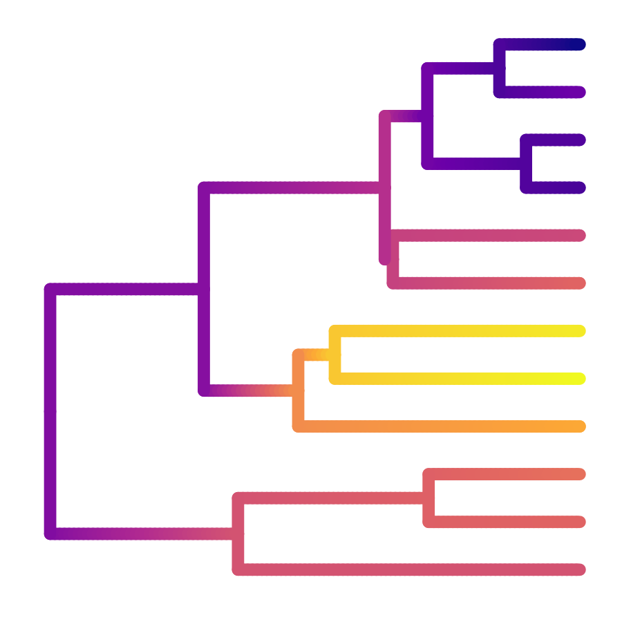
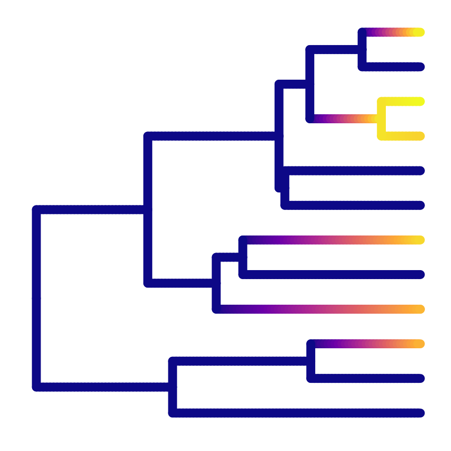

# Example phylogenetic effect
The following script creates dummy example visualisations of phylogenetic effects for teaching purposes.

## Dependencies
```R
install.packages("ape")
install.packages("viridis")
install.packages("tidyverse")
```

## Code
```R
# Load the necessary libraries
library(ape)
library(ggtree)
library(tidyverse)

# Generate a random tree with 12 tips
set.seed(123)  # Setting a seed for reproducibility
tree_12_tips <- rtree(12)

# Convert to ultrametric tree using chronos
ultrametric_tree <- chronos(tree_12_tips)

class(ultrametric_tree) <- "phylo"

traits <- c(63, 66, 58, 96, 93, 80, 63, 55, 23, 25, 31, 14,
            35, 58, 62, 36, 73, 86, 48, 53, 32, 25, 24)

# Plot the tree using ggtree with node and tip numbers
ggtree(ultrametric_tree, aes(color = traits), continuous = "color", size = 2) + 
  scale_color_viridis_c(name = "body size", option = "C") + 
  geom_text2(aes(label=node), hjust=-0.5)

p_1 <- ggtree(ultrametric_tree, aes(color = traits), continuous = "color", size = 2) + 
  scale_color_viridis_c(name = "body size", option = "C") +
  theme(legend.position = "none")

ggsave("example_phylogenetic_effects_1.png", p_1, dpi = 300, width = 3, height = 3)  

traits <- c(24, 24, 24, 24, 24, 24, 81, 85, 87, 93, 91, 88,
            24, 24, 24, 24, 24, 24, 80, 84, 87, 89, 90)

p_2 <- ggtree(ultrametric_tree, aes(color = traits), continuous = "color", size = 2) + 
  scale_color_viridis_c(name = "body size", option = "C") +
  theme(legend.position = "none")

ggsave("example_phylogenetic_effects_2.png", p_2, dpi = 300, width = 3, height = 3)  


traits <- c(24, 85, 24, 24, 92, 86, 24, 24, 91, 98, 24, 96,
            24, 24, 24, 24, 24, 24, 24, 24, 24, 94, 24)


p_3 <- ggtree(ultrametric_tree, aes(color = traits), continuous = "color", size = 2) + 
  scale_color_viridis_c(name = "body size", option = "C") +
  theme(legend.position = "none")

ggsave("example_phylogenetic_effects_3.png", p_3, dpi = 300, width = 3, height = 3)
```

## Output





